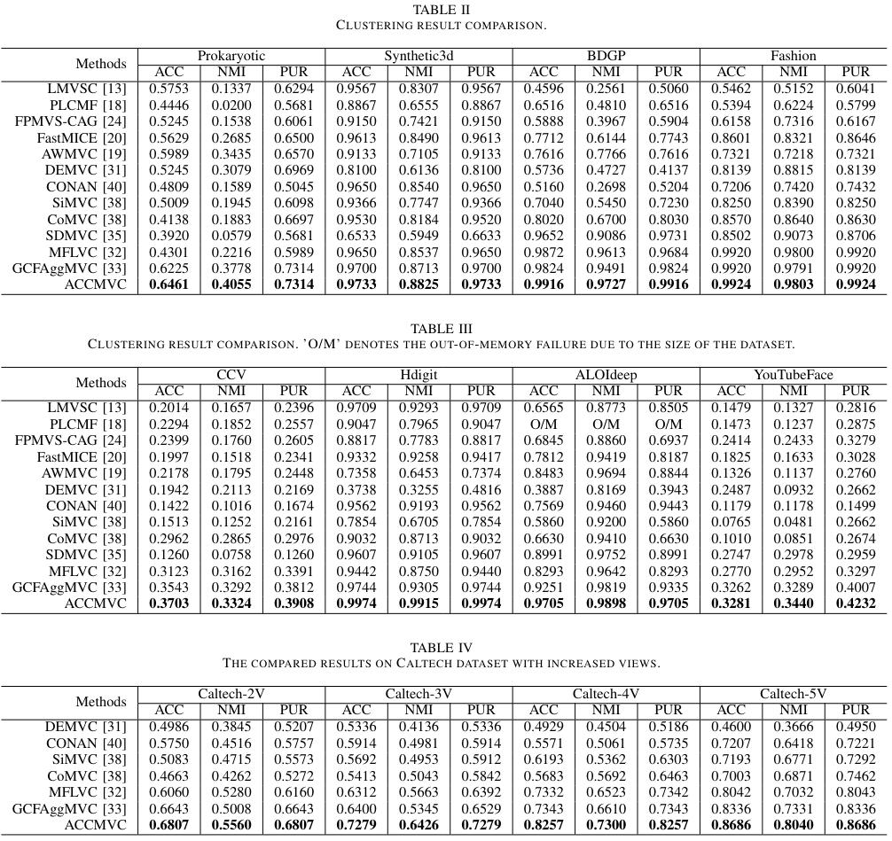

# ACCMVC
Anchor-sharing and Cluster-wise Contrastive Learning Network for Multi-View Representation Learning
## Framework


Overall framework including ASFA module and TPL, and CwCL module. In ASFA, we focus on learning sharing anchor representations that are not
from the samples in a batch and shared across all data. Moreover, we compute the bipartite graph relationship between samples and anchors, which is leveraged
to enhance the self-representations of the samples. In the CwCL, we integrate the learned transition probability to CL and this makes the representations with
high transition probability be more similar.
## Requirements

pytorch==1.12.1

numpy>=1.21.6

scikit-learn>=1.0.2

## Experiment Results


## Citation

If you find our work useful in your research, please consider citing:

```latex
@article{yan2024anchor,
  title={Anchor-Sharing and Clusterwise Contrastive Network for Multiview Representation Learning},
  author={Yan, Weiqing and Zhang, Yuanyang and Tang, Chang and Zhou, Wujie and Lin, Weisi},
  journal={IEEE Transactions on Neural Networks and Learning Systems},
  year={2024},
  publisher={IEEE}
}
```

If you have any problems, contact me via zhangyuanyang922@gmail.com.
